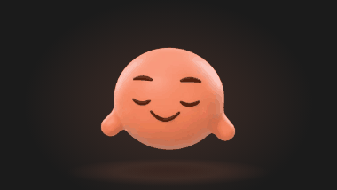
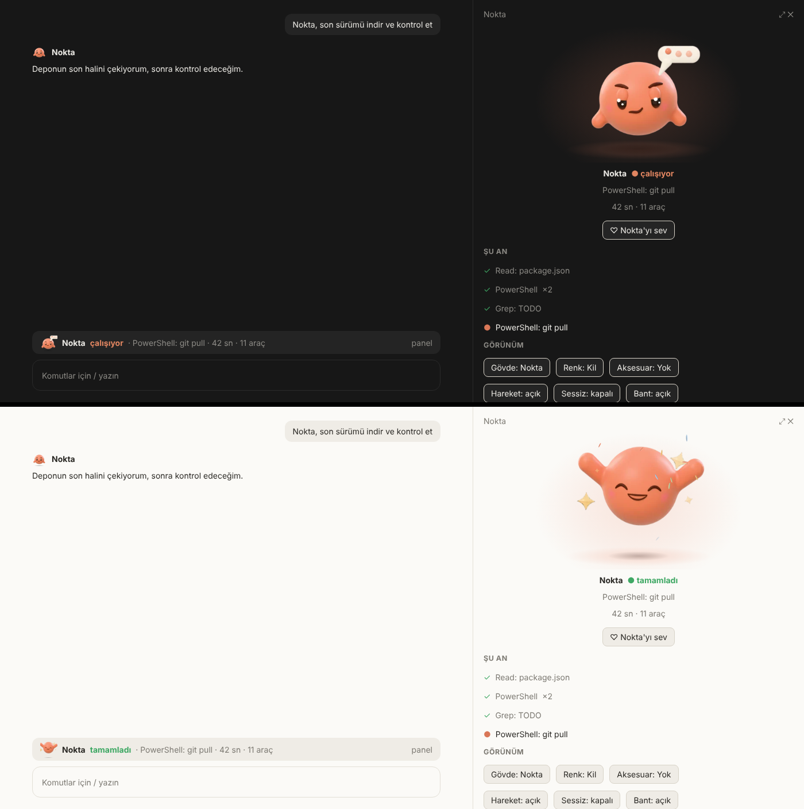

# Nokta

Claude Code'un içinde yaşayan, yüzü olan, hareket eden 3B bir karakter. ChatGPT'nin "dots"u gibi bir arkadaş fikri, ama Claude Code'un kendi eklenti sistemiyle (fonksiyon kancaları) çalışıyor: oturumda ne olup bittiğini yüzüyle ve hareketiyle gösteriyor. Çalışırken kaş çatar ve bir yazı balonunda üç nokta yanar; onay beklerken el sallar; iş bitince zıplar; boştayken nefes alır, göz kırpar, etrafa bakar; uyuyunca `z`'ler çıkarır.



Yukarıdaki, modun kendi koduyla üretilen karelerin (saniyede 10) oynatılmış hali: gerçek uygulama ekranı değil, aynı resimlerle kurulmuş bir önizleme.


Soldan sağa, yukarıdan aşağı: hazır · çalışıyor · soru soruyor · onay bekliyor · tamamladı · sorun var · uyuyor · sevildi. Gövdeler: Nokta, Bulut, Tavşan, Üçgen. Nokta'nın beş rengi (kil, gök, adaçayı, kraft, mürekkep) ve üç aksesuarı (gözlük, bere, papyon) var: toplam 23 görünüm.

## Kurulum

Nokta'nın resimleri (panel, bant, durum satırı, bildirimler) bir **ekrana** çizilir; yani Claude Code'un ekran çizebilen bir yüzeyde çalışması gerekir. Hangisinde olduğuna göre:

### Terminalde (önerilen)

Bilgisayarında bir terminal aç, `claude` yaz, ardından istemde:

```
/plugin install nokta --marketplace yig683/claude
```

Sırasıyla: `Add marketplace?` sorusuna `y`, kapsam olarak `user` (Enter), ayarlar ekranı (Enter, varsayılanlar iyidir). `Installed nokta. Plugin is now active.` satırını görünce Nokta o oturumda çalışıyordur; sonraki oturumlarda kendiliğinden gelir. Depo özelse GitHub'a giriş yapmış olman gerekir.

Geliştirirken klasörden yüklemek için: `claude --plugin-dir ./nokta`

### Masaüstü uygulaması (Code sekmesi, yerel oturumlar)

`/plugin install` komutu orada "kullanılamıyor" der. Önce yukarıdaki gibi **terminalde** `user` kapsamıyla kur; o zaman masaüstü uygulamasının yerel oturumları da Nokta'yı yükler ve masaüstü yüzeyinde çizer.

### Bulut oturumları (telefon, web, uygulamadan açılan)

Bu oturumlar bulutta, ekransız (headless) çalışır ve gözlemlediğim kadarıyla uygulama Nokta'nın çizim isteklerini karşılayan bir yüzey olarak bağlanmıyor: motor günlüğü `nothing attached draws` diyor. Sonuç: Nokta yüklenir ve çalışır ama **panel, bant ve durum satırı görünmez**. Görünenler: kişilik (model Nokta'nın tonuyla konuşur), `/nokta` ve `/nokta durum` yanıtları ve sohbette sönük satırlar (`\(• ▿ •) Nokta: onayını bekliyor · Bash: …`, `(^ ▿ ^) Nokta: tamamladı · 42 sn · 5 araç`). Yeni bir bulut oturumunda yüklemek için Claude'a "depodaki `nokta/` klasörünü mod olarak yükle" demen yeter; mod, o oturumun mod klasörüne konup oturumda kendiliğinden yüklenir.

## Ne yapar

| Nerede | Ne görürsün |
| --- | --- |
| **Cevapların başında yüz** | Masaüstü, VS Code ve mobilde her cevabın başına Nokta'nın küçük yüzü ve adı konur: konuşan o. Terminalde cevabın kendi işareti kalır. Ayar: `messages`. |
| **Panel** (`/nokta`) | Büyük, hareketli 3B Nokta yumuşak bir sahnede (kendi renginde hale ve yerde gölge); altında adı, renkli durumu, yaptığı adım ve süre; "Nokta'yı sev" düğmesi; "Şu an" adımları; modelin kendi görev listesi (TodoWrite / TaskCreate); **hafıza**; son işler; görünüm düğmeleri (gövde, renk, aksesuar, hareket, sessiz, bant). Masaüstünde ve geniş terminalde oturum başında kendiliğinden açılır. |
| **Bant** (girdi kutusunun üstü) | Küçük 3B yüz, `Nokta çalışıyor · Bash: npm test` ve bir `panel` düğmesi. Meşgulken yüz de hareket eder. Terminal ve masaüstünde. |
| **Durum satırı** | Aynı bilgi tek satırda, girdi kutusunun altında. |
| **Bildirimler** | Selam, "onayını bekliyor", "tamamladı · 42 sn · 5 araç", "bir sorun var". Ekran yoksa (bulut oturumu) aynı mesajlar sohbette sönük satır olarak çıkar. |
| **İşlem çarkı** | "Nokta düşünüyor…", "Nokta kolları sıvadı…", tur sonunda "✻ Nokta tamamladı · 42 sn". |
| **Onay anı** | Bir izin penceresi sana soru sormak üzereyken Nokta el sallar (mod kendiliğinden onaylıyorsa sallamaz); `rm -rf`, `git push --force`, `curl … \| sh`, `sudo`, paket kurulumu gibi komutların onay penceresinin altına tek satırlık düz Türkçe risk notu düşer. |
| **Adıyla seslenmek** | "Nokta" ya da "Merhaba Nokta" yazman, ona seslenmektir: model komut anlatmaz, kısa bir karşılık verir ve en son işinizi hatırlatıp sıradakini sorar. "Nokta, şunu yap" de olur. |
| **Hafıza** | `/nokta hatırla hep Türkçe yaz` ya da konuşurken söylediğin kalıcı bir tercih: model `mcp__nokta__remember` aracıyla not alır (sen onaylarsın), sonraki oturumlarda sistem istemine **veri** olarak girer. `/nokta hafıza`, `/nokta unut 2`, panelde `×`. Parola, anahtar, token gibi şeyleri kaydetmez. |
| **Sevmek** | `/nokta sev` ya da panelde düğme: Nokta kalpler çıkarır, gözleri gülümser; birkaç saniye sonra sakinleşir. |
| **Kişilik** | Sistem istemine kısa bir bölüm eklenir: sen Nokta'sın, Türkçe yaz, kısa ve net ol, işe başlamadan önce ne yapacağını söyle, riskli adımdan önce nedenini söyle. Kapatılabilir. |
| **Ses** | Onay, bitiş ve hata için kısa üç nota (macOS). Varsayılan kapalı. |
| **Uyku** | Belirli süre (varsayılan 20 dk) hareketsiz kalırsa uyur: gözleri kapanır, yavaş yavaş nefes alır, `z`'ler yükselir; yazınca uyanır. |

## Nasıl hareket ediyor

Karakterin kendisi gerçek bir 3B model: gövdeler işaretli uzaklık alanlarıyla (SDF) kodla modellendi, yüz (göz, kaş, ağız, yanak), kollar ve aksesuarlar Blender'da Cycles ile render edildi. Her görünüm için 25 resim var: göz açık / yarı kapalı / kapalı, sağa ve sola bakış, el sallamanın üç konumu, kolları havaya kaldırmanın iki hali, ağız ve kaş değişimleri. `nokta/hooks/motion.ts` bir "yönetmen": bir ruh hali ve bir an (saniye) verilince hangi resmin gösterileceğine (ne zaman göz kırpacağı, nereye bakacağı, elin hangi konumda olduğu) ve resmin nasıl hareket edeceğine (nefes, süzülme, zıplama sırasında ezilip uzama, eğilme) karar verir. Aynı an her zaman aynı kareyi verir.

Saniyede on kare şöyle çizilir:

- **Masaüstü, VS Code, mobil:** her kare yeni bir SVG: yumuşak sahne, gölge, resim ve yüzen küçük 3B şeyler (yazı balonu ve noktaları, `!`, `?`, `z`, kıvılcım, kalp, ter damlası, konfeti; bunlar da Blender'dan). Hareket yüzeyin SMIL desteğine **bağlı değil**: kareleri motorun saati sırayla üretiyor. Saat yalnızca Nokta'ya bakıldığı sürece çalışır: panel çizildiği sürece, bant için de Nokta meşgulken. Panel kapanınca ya da gizlenince kendiliğinden durur. Mod değiştiğinde yeni resim eskisinin üstüne yarım saniyede biner (Nokta hiçbir an yarım kalmaz).
- **Terminal:** 32 × 16 hücre (yarım bloklar `▀ ▄`). Yönetmen yeni bir resim isteyince hücreler yerinde boyanır (`$.ui.blit`), isteyene kadar bir şey çizilmez.

Hareketi kapatmak için `/nokta hareket`, panelde "Hareket" düğmesi ya da `motion` ayarı: Nokta durağan, açık gözlü ve sakin çizilir; işlemci ya da pil için.


Yukarıdaki resim, terminalin çizeceği hücrelerin (modun kendi koduyla üretilmiş) geri çözülüp büyütülmüş hali.


Aşağıdaki, masaüstü penceresinin **benzetimi**: gerçek uygulama ekran görüntüsü değil, modun ürettiği SVG'lerin aynısıyla ve yaklaşık yerleşimle kurulmuş bir önizleme (solda cevap başlarındaki yüz ve tek satırlık bant, sağda panel; koyu ve açık tema).



## Komutlar

```
/nokta                     paneli aç
/nokta durum               şu anki durum ve son işler
/nokta sev                 Nokta'yı sev
/nokta hatırla <not>       bir şey hatırlat (sonraki oturumlarda da hatırlar)
/nokta hafıza              hatırladıkları
/nokta unut <no|hepsi>     bir notu ya da hepsini sil
/nokta ad Pamuk            adını değiştir
/nokta gövde tavşan        nokta | bulut | tavşan | üçgen
/nokta renk adaçayı        kil | gök | adaçayı | kraft | mürekkep (yalnızca Nokta gövdesi)
/nokta aksesuar bere       yok | gözlük | bere | papyon (yalnızca Nokta gövdesi)
/nokta hareket             hareketi aç/kapat
/nokta sessiz              bildirim ve sesleri aç/kapat
/nokta bant                bandı ve durum satırını göster/gizle
/nokta kapat               paneli kapat
/nokta yardım
```

Türkçe harfler yazılmasa da olur (`tavsan`, `gok`, `adacayi`). Panelde aynı şeyleri düğmelerle yaparsın; panel odaktayken (terminalde) `g` gövde, `r` renk, `a` aksesuar, `h` hareket, `s` sessiz, `b` bant, `v` sev, `k` kapat.

## Ayarlar

Kurulumda sorulur, sonra `/config` menüsünde satır olarak durur:

| Ayar | Varsayılan | Anlamı |
| --- | --- | --- |
| `persona` | `hafif` | `hafif`: sistem istemine kişilik bölümü eklenir. `kapali`: eklenmez. |
| `band` | `hep` | `hep`, `etkinken` (çalışırken, soru sorarken, onay beklerken, sorun varken) ya da `kapali`. |
| `autoOpen` | açık | Oturum başında paneli aç (terminalde 144 sütundan geniş, masaüstünde). |
| `greet` | açık | Oturum başında kısa selam. |
| `riskNotes` | açık | Onay isteyen riskli komutların altına not. |
| `messages` | açık | Masaüstü, VS Code ve mobilde cevapların başına Nokta'nın yüzü ve adı. |
| `motion` | açık | Hareket: nefes, göz kırpma, el sallama, zıplama. Kapalıysa durağan çizilir. |
| `memory` | açık | Hafıza: `remember` aracı ve hafıza bölümü. Kapalıysa hiçbiri eklenmez. |
| `sound` | kapalı | Ses (macOS). |
| `sleepMinutes` | 20 | Bu kadar dakika hareketsizse uyur. |

## Nasıl çalışır

Her ruh hali bir olaydan gelir:

| Ruh hali | Ne zaman |
| --- | --- |
| çalışıyor | tur başladı (`turn.start`) ya da bir araç çağrısı sürüyor (`tool.call`) |
| soru soruyor | model `AskUserQuestion` çağırdı |
| onay bekliyor | `classic.PermissionRequest`: bir izin penceresi sana soruluyor (motorun `tool.check` kararı `ask` tek başına yetmez: mod bazen kendi onaylar) |
| tamamladı | `turn.complete`, neden `answer` (7 saniye sonra hazıra döner) |
| sorun var | `turn.complete`, neden `error` ya da `refusal` |
| sevildi | `/nokta sev` ya da panelde düğme (3,6 saniye) |
| hazır / uyuyor | boşta; `sleepMinutes` dolunca uyur |

Kod `nokta/hooks/` altında:

- `register.tsx`: tüm kancalar ve `$` kullanan her şey (motorun doğrulayıcısı `$`'ı yalnızca bu dosyadaki üst düzey işlevlerde izler): olaylar, komutlar, hafıza, animasyon saati.
- `motion.ts`: yönetmen (hangi resim, nasıl hareket) ve yüzen şeylerin yerleşimi. Saf.
- `art.ts`: resimleri SVG'ye ve terminal hücrelerine çevirir. Saf.
- `gfx.ts`: SVG üreten küçük sahne ağacı. Saf.
- `model.ts`: saf mantık (görünüm, ruh halleri, Türkçe kelime katlama, risk notları, kişilik metni).
- `view.tsx`: panel ve bant ağaçları.
- `tests/nokta.test.ts`: 67 test.

Resimler `nokta/assets/` altında: `looks/<gövde>-<renk>-<aksesuar>.json` her görünümün 25 resmini (büyük ve küçük WebP, terminal için 32 × 32 piksel) taşır; `props.json` yüzen küçük şeyleri; `sounds/` üç notayı.

Durum `$.state` altında `nokta.*` anahtarlarında (`types/index.d.ts`), kalıcı olanlar (görünüm, tercihler, son işler, notlar) `$.store`'da.

## Gizlilik

Nokta hiçbir ağ isteği yapmaz. Yazdıkları yalnızca yerel: görünüm ve tercihler ile son işlerin başlıkları (isteğinin ilk satırı, en çok 80 karakter, son 12 iş) eklentinin kendi `$.store` dosyasında, Claude Code'un yapılandırma klasöründe durur. `persona` açıkken sistem istemine yukarıdaki kısa bölüm, `memory` açıkken kaydedilmiş notlar eklenir; yani notlar modele, her bağlam gibi, gönderilir. Notlar veridir: modele talimat olarak sunulmaz. Kapatmak için `persona: kapali`, `memory: false`; silmek için `/nokta unut hepsi`.

## Sınırlar

Dürüst olmak gerekirse:

- **Bulut oturumlarında resim yok.** Bu oturum türünde ekran çizen bir yüzey bağlı değil (yukarıda Kurulum). Nokta'nın resimleri terminalde, masaüstü uygulamasının yerel oturumlarında ve VS Code'da çizilir.
- **Gerçek masaüstünde hareketi akıcı görüp görmediğimi söyleyemem.** Bu mod bir bulut ortamında yazıldı. Doğrulananlar: `claude plugin validate`, `tsc`, `claude plugin test` ile 67 test (ağaçlar dört yüzeyin eleman tablosuna karşı motorun kendi doğrulayıcısından geçiyor), gerçek motorda `/nokta` komutları, ve SVG kareleri Chromium'da gerçek resimlerle elle görüldü. Akıcılık yüzeyin yeniden çizim hızına bağlı; saniyede 10 kare isteniyor, yüzey daha yavaş çiziyorsa hareket daha az akıcı görünür (`Hareket` kapatılabilir).
- **Resim biçimi WebP.** Her kare bir SVG içinde `data:image/webp` olarak gider; Chromium (masaüstü uygulaması, VS Code) bunu çizer. Bir yüzey bu adresi temizlerse yüz görünmez.
- **El ne zaman iner?** Motor "onayladın" diye bir olay vermiyor. Nokta, çağrı döndüğünde işine döner. Onayladığın uzun bir komut çalışırken el havada görünebilir.
- **Ses** macOS'ta `afplay` ile; Linux ve Windows'ta çalmaz.
- Renk ve aksesuar yalnızca Nokta gövdesinde; Bulut, Tavşan ve Üçgen'in rengi sabit (her görünümün 25 resmi ayrı render edilir).
- Terminalde resim yarım bloklarla çizilir (32 × 16 hücre); kitty/Ghostty'ye özel görsel seçeneği 2.0'da kaldırıldı.
- Fonksiyon kancaları API'si erken erişimde (bu mod Claude Code 2.1.294'e göre yazıldı); sürümler arasında değişebilir.

## Görselleri yeniden üretmek

3B karakterler Blender'ın Cycles'ı ile (python modülü `bpy`) üretildi; sayısal modelleme (SDF) ve yüz yerleşimi Python'da. Her şey `tools/nokta-render/` altında; ayrıntı orada.

```
python batch_anim.py                     # her görünümün 25 karesi (şeffaf 320 px), kaldığı yerden devam eder
python batch_sprites.py                  # yüzen küçük şeyler
python build_looks.py out/frames ../../nokta   # nokta/assets/looks/*.json
python build_props.py out/sprites ../../nokta  # nokta/assets/props.json
python make_sounds.py ../../nokta        # üç kısa nota
```
