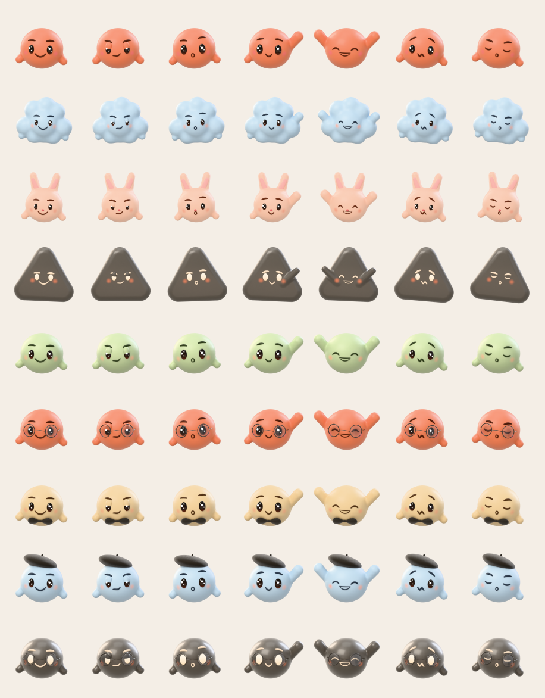
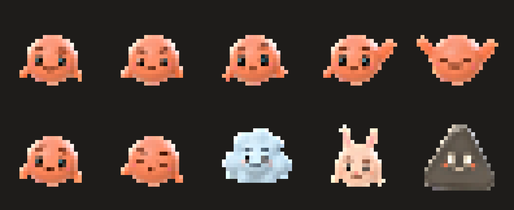
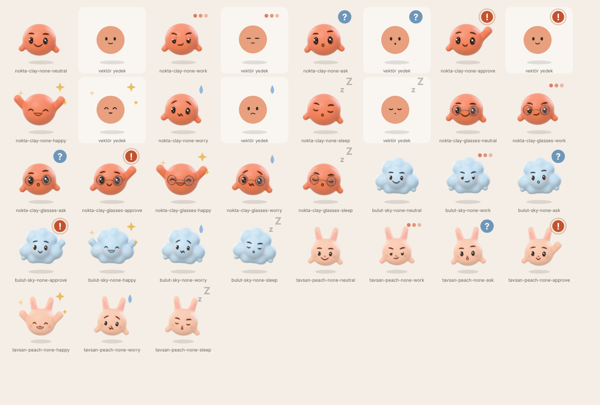

# Nokta

Claude Code'un içinde yaşayan, yüzü olan küçük bir karakter. ChatGPT'nin "dots"u gibi bir arkadaş fikri, ama Claude Code'un kendi eklenti sistemiyle (fonksiyon kancaları) çalışıyor: oturumda ne olup bittiğini yüzüyle gösteriyor.



Soldan sağa: hazır · çalışıyor · soru soruyor · onay bekliyor · tamamladı · sorun var · uyuyor.
Gövdeler: Nokta, Bulut, Tavşan, Üçgen. Nokta'nın beş rengi ve üç aksesuarı (gözlük, bere, papyon) var.

## Kurulum

Bir Claude Code oturumunun istemine şunu yaz:

```
/plugin install nokta --marketplace yig683/claude
```

Sırasıyla: `Add marketplace?` sorusuna `y`, kapsam olarak `user`, ardından ayarlar ekranı. `Installed nokta. Plugin is now active.` satırını görünce Nokta o oturumda çalışıyordur; sonraki oturumlarda kendiliğinden gelir.

Geliştirirken klasörden yüklemek için: `claude --plugin-dir ./nokta`

`/plugin install` terminalin komutudur; masaüstü uygulamasının Code sekmesindeki yerel oturumlarda "kullanılamıyor" der. Terminalde `user` kapsamıyla kurulan eklenti o oturumlarda da yüklenir ve masaüstü yüzeyinde çizilir.

## Ne yapar

| Nerede | Ne görürsün |
| --- | --- |
| **Panel** (`/nokta`) | Büyük 3B Nokta, adı, ruh hali, süre ve araç sayısı; "Şu an" adımları; modelin kendi görev listesi (TodoWrite / TaskCreate); son işler; görünüm düğmeleri (gövde, renk, aksesuar, sessiz, bant). Geniş terminalde oturum başında kendiliğinden açılır. |
| **Bant** (girdi kutusunun üstü) | `(• _ •) Nokta çalışıyor · Bash: npm test` ve bir `panel` düğmesi. Terminal ve masaüstünde. |
| **Durum satırı** | Aynı bilgi tek satırda, girdi kutusunun altında. |
| **Bildirimler** | Selam, "onayını bekliyor", "tamamladı · 42 sn · 5 araç", "bir sorun var". |
| **İşlem çarkı** | "Nokta düşünüyor…", "Nokta kolları sıvadı…", tur sonunda "✻ Nokta tamamladı · 42 sn". |
| **Onay anı** | Bir araç çağrısı senin onayını beklerken Nokta el kaldırır; `rm -rf`, `git push --force`, `curl … \| sh`, `sudo`, paket kurulumu gibi komutların onay penceresinin altına tek satırlık düz Türkçe risk notu düşer. |
| **Kişilik** | Sistem istemine kısa bir bölüm eklenir: Türkçe yaz, kısa ve net ol, işe başlamadan önce ne yapacağını söyle, riskli adımdan önce nedenini söyle. Kapatılabilir. |
| **Ses** | Onay, bitiş ve hata için kısa üç nota (macOS). Varsayılan kapalı. |
| **Uyku ve göz kırpma** | Belirli süre hareketsiz kalırsa uyur, yazınca uyanır. Terminal panelinde, boştayken, zaman zaman göz kırpar. |

Her yüzey kendi çizim tablosunu kullanır:

| Yüzey | Resim |
| --- | --- |
| Terminal | Yarım blok (`▀ ▄`) hücre ızgarası, 24 × 12 hücre, her terminalde. `terminalImages: kitty` ve kitty / Ghostty / WezTerm'de gerçek 3B PNG. |
| Masaüstü, VS Code, mobil | SVG: 3B render, üstünde ruh haline göre küçük bir rozet (üç nokta, `?`, `!`, kıvılcım, ter damlası, `z`) ve nefes alma hareketi. |



Yukarıdaki resim, terminalin çizeceği hücrelerin (modun kendi koduyla üretilmiş) geri çözülüp büyütülmüş hali.



Her ruh halinin iki hali var: render'lı SVG, ve yanında açık renkli kutuda render yüklenemezse görünecek vektör yedek yüz. Bir yüzey `<image>` içindeki veri adresini temizlerse Nokta yine de yüzsüz kalmaz.

## Komutlar

```
/nokta                     paneli aç
/nokta durum               şu anki durum ve son işler
/nokta ad Pamuk            adını değiştir
/nokta gövde tavşan        nokta | bulut | tavşan | üçgen
/nokta renk adaçayı        kil | gök | adaçayı | kraft | mürekkep (yalnızca Nokta gövdesi)
/nokta aksesuar bere       yok | gözlük | bere | papyon (yalnızca Nokta gövdesi)
/nokta sessiz              bildirim ve sesleri aç/kapat
/nokta bant                bandı ve durum satırını göster/gizle
/nokta kapat               paneli kapat
/nokta yardım
```

Türkçe harfler yazılmasa da olur (`tavsan`, `gok`, `adacayi`). Panelde aynı şeyleri düğmelerle yaparsın; panel odaktayken `g` gövde, `r` renk, `a` aksesuar, `s` sessiz, `b` bant, `k` kapat.

## Ayarlar

Kurulumda sorulur, sonra `/config` menüsünde satır olarak durur:

| Ayar | Varsayılan | Anlamı |
| --- | --- | --- |
| `persona` | `hafif` | `hafif`: sistem istemine kişilik bölümü eklenir. `kapali`: eklenmez. |
| `band` | `hep` | `hep`, `etkinken` (çalışırken, soru sorarken, onay beklerken, sorun varken) ya da `kapali`. |
| `autoOpen` | açık | Oturum başında paneli aç (terminalde 144 sütundan geniş, masaüstünde). |
| `greet` | açık | Oturum başında kısa selam. |
| `riskNotes` | açık | Onay isteyen riskli komutların altına not. |
| `sound` | kapalı | Ses (macOS). |
| `terminalImages` | `raster` | `kitty`: kitty ve Ghostty'de gerçek görsel. |
| `sleepMinutes` | 8 | Bu kadar dakika hareketsizse uyur. |

## Nasıl çalışır

Her ruh hali bir olaydan gelir:

| Ruh hali | Ne zaman |
| --- | --- |
| çalışıyor | tur başladı (`turn.start`) ya da bir araç çağrısı sürüyor (`tool.call`) |
| soru soruyor | model `AskUserQuestion` çağırdı |
| onay bekliyor | `tool.check` kararı `ask`: çağrı senin onayını bekliyor |
| tamamladı | `turn.complete`, neden `answer` (7 saniye sonra hazıra döner) |
| sorun var | `turn.complete`, neden `error` ya da `refusal` |
| hazır / uyuyor | boşta; `sleepMinutes` dolunca uyur |

Kod `nokta/hooks/` altında:

- `register.tsx`: tüm kancalar ve `$` kullanan her şey (motorun doğrulayıcısı `$`'ı yalnızca bu dosyadaki üst düzey işlevlerde izler).
- `model.ts`: saf mantık (görünüm, ruh halleri, Türkçe kelime katlama, risk notları, kişilik metni).
- `art.ts`: saf çizim (hücreler, SVG, base64).
- `view.tsx`: panel ve bant ağaçları.
- `tests/nokta.test.ts`: 37 test.

Durum `$.state` altında `nokta.*` anahtarlarında (`types/index.d.ts`), kalıcı olanlar (görünüm, tercihler, son işler) `$.store`'da.

## Gizlilik

Nokta hiçbir ağ isteği yapmaz. Yazdıkları yalnızca yerel: görünüm ve tercihler ile son işlerin başlıkları (isteğinin ilk satırı, en çok 80 karakter, son 12 iş) eklentinin kendi `$.store` dosyasında, Claude Code'un yapılandırma klasöründe durur. `persona` açıkken sistem istemine yukarıdaki kısa bölüm eklenir; kapatmak için `persona: kapali`.

## Sınırlar

Dürüst olmak gerekirse:

- **Çizimi gerçek yüzeylerde görmedim.** Bu mod bir bulut ortamında yazıldı: terminalde Ink'in ve masaüstü sayfasının gerçek boyasını göremedim. Doğrulananlar: `claude plugin validate`, `tsc`, ve `claude plugin test` ile 37 test (ağaçlar dört yüzeyin eleman tablosuna karşı motorun kendi doğrulayıcısından geçiyor, `Raster` hücreleri dahil). SVG'ler Chromium'da, hücreler görüntüye geri çevrilerek elle bakıldı.
- **El ne zaman iner?** Motor "onayladın" diye bir olay vermiyor. Nokta, çağrı döndüğünde işine döner. Onayladığın uzun bir komut çalışırken el havada görünebilir.
- **SVG hareketi** (nefes, rozet) yüzeyin SMIL desteğine bağlı; çalışmazsa durağan resim görünür.
- **Ses** macOS'ta `afplay` ile; Linux ve Windows'ta çalmaz.
- **Gerçek 3B görsel** terminalde yalnızca kitty protokolünü bilenlerde (kitty, Ghostty, WezTerm). Diğerlerinde hücre ızgarası.
- Renk ve aksesuar yalnızca Nokta gövdesinde; Bulut, Tavşan ve Üçgen'in rengi sabit.
- Fonksiyon kancaları API'si erken erişimde (bu mod Claude Code 2.1.294'e göre yazıldı); sürümler arasında değişebilir.

## Görselleri yeniden üretmek

3B karakterler Blender'ın Cycles'ı ile (python modülü `bpy`) üretildi; sayısal modelleme (SDF) ve yüz yerleşimi Python'da. Her şey `tools/nokta-render/` altında; ayrıntı orada.

```
python batch_icons.py                     # 161 şeffaf 512 px görsel
python build_assets.py <görseller> ../../nokta   # modun assets/icons ve raster.json dosyaları
python make_sounds.py ../../nokta         # üç kısa nota
```
